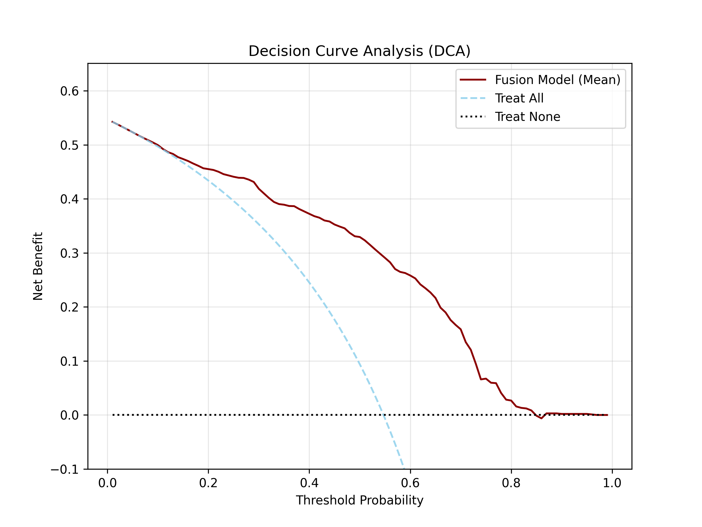
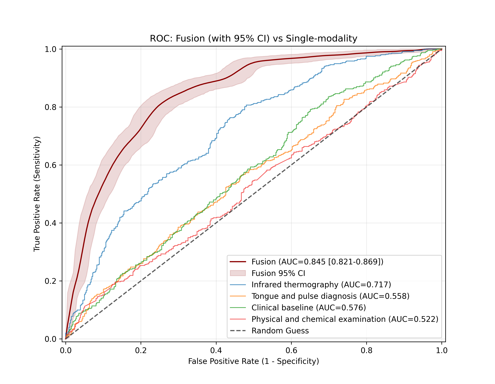

This page provides the original figures, interactive visualizations, source data and figure legends accompanying the manuscript.

---
<!--******************************** Figure 1 ********************************-->
# Figure 1. Decision Curve Analysis (DCA)

## Original Figure

{fig-align="center" width="85%"}

---

## Interactive Figure

::: {.callout-note}
The interactive Plotly version of this figure will be added here.
:::

<div id="plotly_figure1" style="width:100%;height:600px;"></div>

---

## Source Data

```{python}
import pandas as pd
from IPython.display import HTML

# 读取 CSV
df = pd.read_csv("assets/data/DCA_Curve_Data.csv")

# 输出 HTML Table
HTML(
    df.to_html(
        index=False,
        table_id="figure1_table",
        classes=[
            "display",
            "compact",
            "stripe",
            "hover",
            "nowrap"
        ],
        border=0,
        escape=False
    )
)
```

---

## Download Source Data

<a href="assets/data/DCA_Curve_Data.csv"
   download
   class="btn btn-primary">
⬇ Download CSV
</a>

---

## Figure Legend

> **Decision Curve Analysis (DCA).**

Replace this section with the original figure legend exactly as it appears in the manuscript.

---

<!--******************************** Figure 2 ********************************-->
# Figure 2. ROC Comparison

## Original Figure

{fig-align="center" width="85%"}

---

## Interactive Figure

::: {.callout-tip}
Click legend items to toggle curves on/off — same functionality as the desktop viewer with checkboxes.
:::

```{python}
#| fig-align: center
#| fig-width: 10
import runpy
_ = runpy.run_path("assets/script/interactive_roc_viewer.py", run_name="__main__")
```

---

## Source Data

```{python}
import pandas as pd
from IPython.display import HTML

# 读取 CSV
df = pd.read_csv("assets/data/DCA_Curve_Data.csv")

# 输出 HTML Table
HTML(
    df.to_html(
        index=False,
        table_id="figure1_table",
        classes=[
            "display",
            "compact",
            "stripe",
            "hover",
            "nowrap"
        ],
        border=0,
        escape=False
    )
)
```

---


## Download Source Data

<a href="assets/data/ROC_Comparison_Data_new.csv"
   download
   class="btn btn-primary">
⬇ Download CSV
</a>

---

## Figure Legend

> **ROC Comparison: Fusion (with 95% CI) vs Single-modality.**

Bootstrap-derived mean ROC curve for the fusion model (dark red) with 95% confidence band, compared against four single-modality baseline models. Click legend items to toggle individual curves.

---