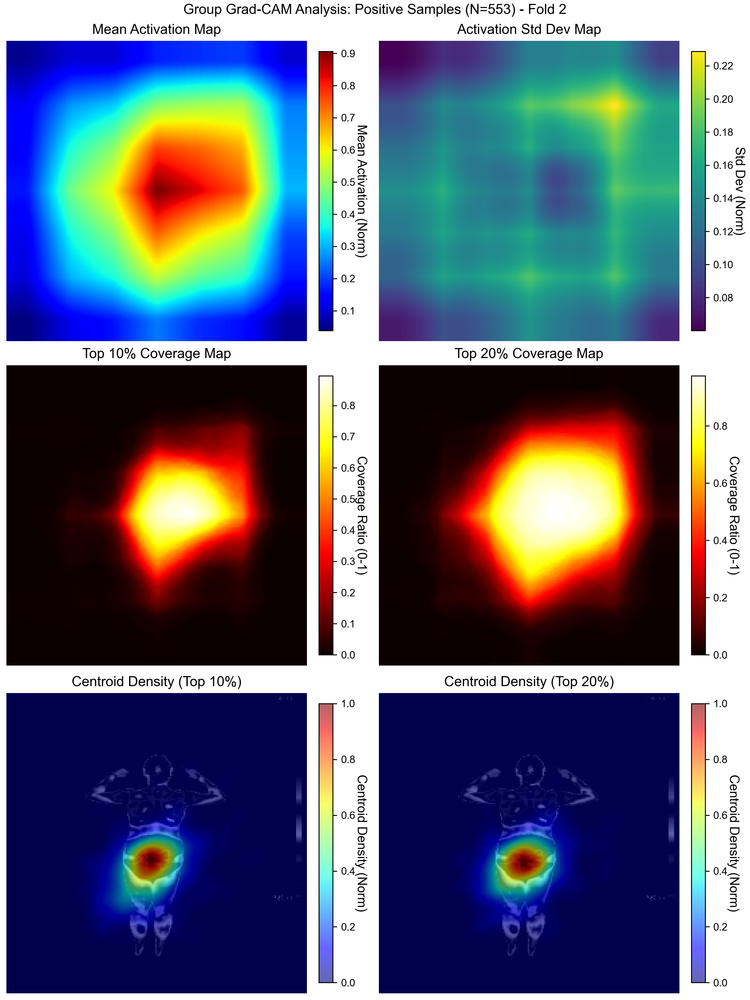

# Auxiliary diagnostic model for Gonghanzheng

::: {.lead}
Template homepage.
:::

## Study Overview

This study is based on three structured data modalities: clinical baseline, physical and chemical examination, and tongue and pulse diagnosis, combined with infrared thermography image modality for fusion modeling, to train a binary classification model for inferring uterine cold syndrome. The total number of included samples is 1011, with 553 samples being positive for uterine cold syndrome (positive category) and 458 samples being negative for uterine cold syndrome (negative category). The basic proportion is average. The performance of the model was evaluated using hierarchical K-Fold cross validation (K=5), with an overall average AUC of 0.849 (95% CI: 0.768-0.932) and an average accuracy ACC of 0.783 (95% CI: 0.724-0.838).
Research has shown that the multimodal deep fusion model proposed in this study effectively integrates the features of four modal branches, achieving complementarity and enhancement between different information sources. The model automatically learns the complementary relationship between different modal features during the training process. The structured dimensionality reduction and nonlinear interaction mechanism of the fusion layer enable the full fusion of modal information, providing an interpretable and generalizable fusion framework for the recognition of uterine cold syndrome. The performance gain is significant, and its discriminative ability, classification accuracy, and robustness are all relatively good.

## Graphical Abstract

{fig-align="center" width="85%"}

## Quick Statistics

|Item|Value|
|---|---|
|Samples|--|
|Figures|--|
|Tables|--|

## Interactive Figures

See **Figures**.

## Interactive Tables

See **Tables**.

## Downloads

See **Downloads**.
